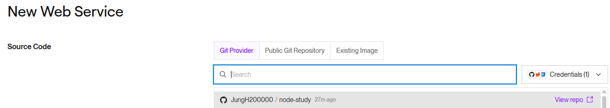
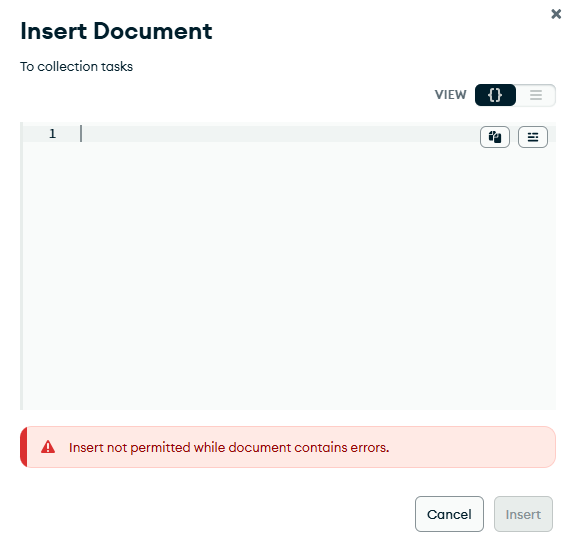
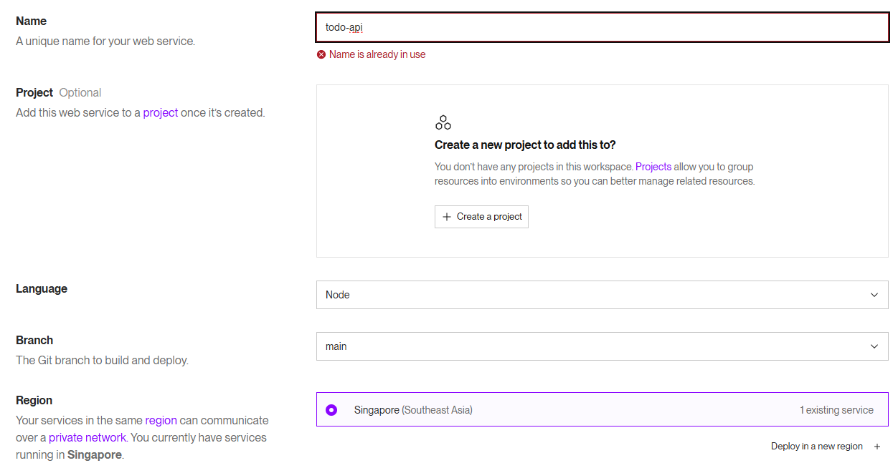
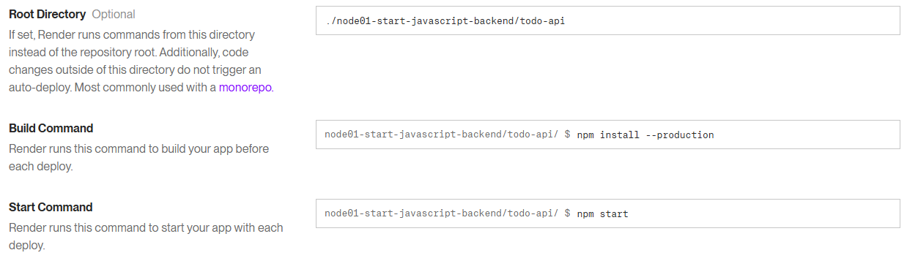
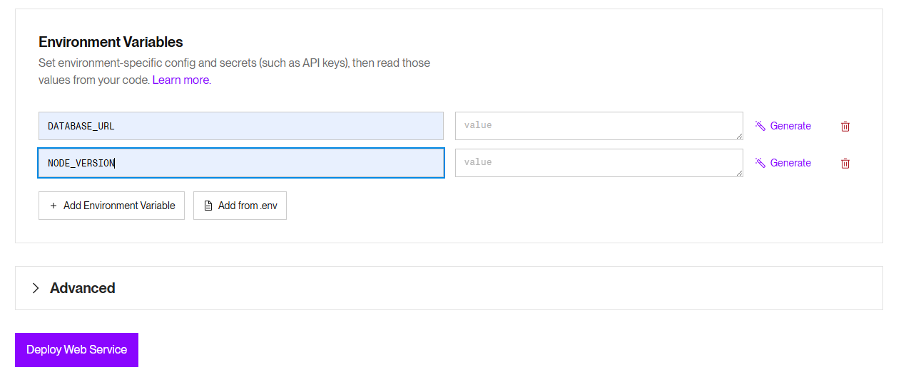

## 🚀 드디어 세상으로! Render로 백엔드 서버 배포하기

지금까지 열심히 개발한 백엔드 서비스를 실제 사용자들이 이용할 수 있도록 세상에 공개하는 **배포(Deployment)** 과정을 진행해 보겠습니다.

우리는 **Render**라는 클라우드 서비스를 이용할 겁니다. Render는 GitHub 연동부터 배포 자동화까지 많은 복잡한 과정을 대신 처리해주어, 초보자도 아주 쉽게 서버를 배포할 수 있게 도와주는 훌륭한 플랫폼입니다.

### 배포 과정 한눈에 보기

1.  **GitHub에 코드 업로드하기**
2.  **Render 가입 및 GitHub 연동하기**
3.  **프로덕션(Production)용 데이터베이스 준비하기**
4.  **Render에서 웹 서비스 생성 및 설정하기**

---

### 1단계: GitHub에 코드 업로드하기 깃

배포의 첫걸음은 우리 코드를 클라우드 서비스가 접근할 수 있는 곳에 두는 것입니다. Render는 GitHub 저장소(Repository)와 직접 연동되므로, 지금까지 작업한 모든 코드가 GitHub에 최신 상태로 `push` 되어 있는지 확인해 주세요.

---

### 2단계: Render 가입 및 GitHub 연동하기 ☁️

1.  **[Render 홈페이지](https://render.com/)**에 접속하여 GitHub 계정으로 가입 또는 로그인한 후, 대시보드로 이동합니다.
2.  오른쪽 위의 **`New +`** 버튼을 누르고 **`Web Service`**를 선택하여 새로운 웹 서비스 만들기를 시작합니다.
3.  `Build and deploy from a Git repository` 섹션에서 **`Connect GitHub`** 버튼을 클릭하여 Render가 내 GitHub 계정에 접근할 수 있도록 인증(Authorize)해 주세요.
4.  연결할 저장소를 선택하는 화면에서, `All repositories`(모든 저장소) 또는 `Only select repositories`를 선택한 뒤 우리가 작업한 `todo-api` 저장소를 지정하고 **`Install`**을 클릭합니다.
5.  다시 Render 화면으로 돌아오면, 방금 연결한 저장소 목록이 보입니다.
    

---

### 3단계: 프로덕션(Production)용 DB 준비하기

웹 서비스를 생성하기 전에, 실제 서비스 환경(Production)에서 사용할 데이터베이스를 MongoDB Atlas에서 준비해야 합니다.

1.  **네트워크 접근 설정 (IP 허용)**

    - MongoDB Atlas 대시보드의 왼쪽 메뉴에서 **`Network Access`**로 이동합니다.
    - **`Add IP Address`** 버튼을 클릭하고, **`Allow Access From Anywhere`**를 선택하세요. IP 주소가 `0.0.0.0/0`으로 설정될 것입니다.
    - **`Confirm`** 버튼을 눌러 저장합니다.

    > **⚠️ 왜 모든 IP를 허용해야 하나요?**
    > Render와 같은 최신 클라우드 서비스는 서버를 실행할 때 고정된 IP 주소를 할당하지 않습니다. 서버가 재시작되거나 확장될 때마다 IP 주소가 바뀔 수 있기 때문에, 특정 IP만 허용하는 방식으로는 Render 서버가 DB에 접속할 수 없습니다. 따라서 모든 IP(`0.0.0.0/0`)에서의 접속을 허용해야 합니다.

2.  **프로덕션 데이터베이스 생성**

    - Atlas 대시보드의 **`Database`** 메뉴로 돌아와 **`Browse Collections`**를 클릭합니다.
    - **`Create Database`** 버튼을 누르고, 새 데이터베이스 이름과 컬렉션 이름을 설정합니다.
      - Database Name: `todo-api-prod`
      - Collection Name: `tasks`
    - **`Create`** 버튼을 눌러 생성합니다.

3.  **테스트 데이터 삽입** - 배포 환경에서 `npm run seed` 같은 명령어를 실행하기는 번거롭습니다. Atlas의 GUI를 이용해 간단한 초기 데이터를 직접 추가할 수 있습니다. - 방금 만든 `tasks` 컬렉션을 선택하고 **`Insert Document`** 버튼을 눌러 JSON 형식으로 데이터를 붙여넣기 하면 됩니다.
    

---

### 4단계: Render 웹 서비스 생성 및 설정하기 ⚙️

이제 Render에서 마지막 설정을 하고 배포를 시작할 차례입니다.

- **Name**: 서비스의 고유한 이름을 정합니다. 이 이름이 URL의 일부가 됩니다. (예: `todo-api-myname`)
- **Region**: 서버 위치를 선택합니다. 보통 가까운 곳(Singapore 등)을 선택하면 좋습니다.
- **Branch**: 배포할 GitHub 브랜치를 선택합니다. (보통 `main` 또는 `master`)
- **Build Command**: 프로젝트 의존성을 설치하는 명령어입니다. `npm install --production`
- **Start Command**: 서버를 시작하는 명령어입니다. `npm start`
- **Instance Type**: `Free` (무료) 플랜을 선택합니다.
  
  

스크롤을 내려 가장 중요한 **환경 변수(Environment Variables)**를 설정합니다.

- **`Environment Variables`** 버튼을 클릭합니다.
- **Key**에는 `DATABASE_URL`, **Value**에는 로컬 `.env` 파일에서 사용하던 MongoDB 연결 주소를 붙여넣습니다.
- **주의!** 붙여넣은 주소의 데이터베이스 이름 부분을 방금 만든 프로덕션 DB 이름으로 변경해야 합니다. (`...mongodb.net/todo-api` → `...mongodb.net/todo-api-prod`)
- **(선택)** `NODE_VERSION` Key를 추가하여 로컬에서 사용하던 Node.js의 메이저 버전(예: `18.17.0`)을 지정해 줄 수 있습니다.
  

모든 설정이 끝났으면 맨 아래의 **`Deploy Web Service`** 버튼을 클릭합니다.

---

### ✅ 배포 완료!

이제 Render가 자동으로 배포를 시작합니다. 설정한 `Build Command`와 `Start Command`를 순서대로 실행하고 서버를 인터넷에 공개합니다. 몇 분 후, 로그 화면에 서버와 DB가 성공적으로 연결되었다는 메시지가 뜨고, 서비스 상태가 **`Live`**로 바뀌면 배포에 성공한 것입니다!

페이지 위쪽에 `https://내-서비스-이름.onrender.com` 형태의 공개 주소가 나타납니다. 이제 이 주소를 사용해 Postman이나 프론트엔드에서 API를 호출할 수 있습니다. (예: `GET https://todo-api-myname.onrender.com/tasks`)

> **🚀 자동 배포 (Auto-Deploy)**
> 기본 설정에 따라, 이제 GitHub 저장소의 `main` 브랜치에 새로운 코드를 `push` 할 때마다 Render가 이를 감지하여 자동으로 다시 배포해줍니다.
