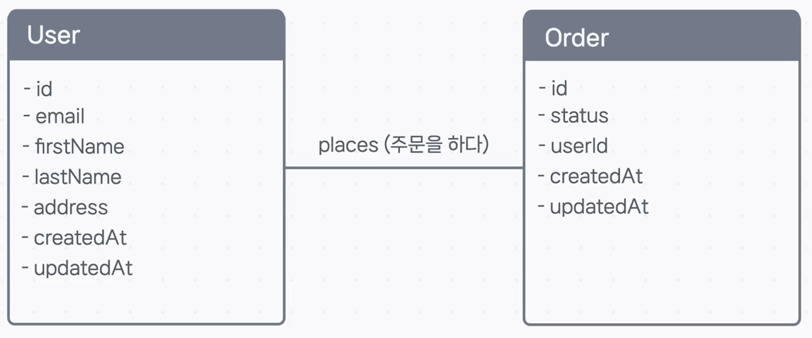

## 🏛️ 데이터베이스의 청사진, 데이터 모델링

코드를 작성하기 전에 건물의 청사진(설계도)을 먼저 그리는 것처럼, 데이터베이스를 만들기 전에도 어떤 데이터를 어떻게 저장할지 미리 계획하고 설계하는 과정이 필요합니다. 이 과정을 **데이터 모델링(Data Modeling)** 이라고 합니다.

**데이터 모델링**이란, 우리 서비스에 어떤 데이터가 필요하고, 그 데이터들은 서로 어떤 관계를 맺고 있는지 파악하여 정교한 설계도로 표현하는 작업입니다.

### 왜 데이터 모델링을 해야 할까요?

물론 다룰 데이터가 한두 개뿐이라면 이 과정을 생략할 수도 있습니다. 하지만 대부분의 경우, 코딩 전에 데이터 모델링을 먼저 하는 것이 훨씬 효율적입니다.

- **실수 방지**: 개발 중간에 예상치 못하게 데이터 구조를 변경해야 하는 큰 공사를 막을 수 있습니다.
- **효율적인 개발**: 잘 만들어진 데이터 모델(설계도)이 있으면, Prisma 스키마 코드를 훨씬 빠르고 쉽게 작성할 수 있습니다.

데이터 구조를 표현하는 데 가장 널리 사용되는 방식 중 하나가 바로 **ER(Entity-Relationship) 모델**입니다.

---

### ER 모델의 3가지 핵심 요소

**ER 모델**은 이름 그대로 **개체(Entity)와 관계(Relationship)** 를 중심으로 데이터 구조를 표현하는 방식이며, **ER 다이어그램**이라고 부르기도 합니다. ER 모델을 구성하는 3가지 핵심 요소를 알아봅시다.

#### 1. 개체 (Entity)

현실 세계에서 우리가 다루고자 하는 **사물 또는 개념**을 의미합니다. 데이터로 관리하고 싶은 명사들을 떠올리면 쉽습니다.

- **예시**: `유저`, `상품`, `주문`, `게시글`
- **매핑**: 하나의 개체는 데이터베이스의 **하나의 테이블(Table)** 이 됩니다.

#### 2. 속성 (Attribute)

각 개체가 갖는 **세부 정보**를 나타냅니다.

- **예시**: `유저`라는 개체는 `성`, `이름`, `이메일` 같은 속성을 가집니다.
- **매핑**: 하나의 속성은 테이블의 **하나의 열(Column)** 이 됩니다.

> **⚠️ 잠깐! 다른 의미의 '속성'**
>
> 여기서 말하는 ER 모델의 '속성(Attribute)'과, 이전에 Prisma 스키마에서 사용했던 `@id` 같은 '속성(Attribute)'은 서로 다른 개념이니 혼동하지 않도록 주의하세요!

#### 3. 관계 (Relationship)

**개체와 개체 사이의 관계**, 즉 상호작용이나 연결고리를 의미합니다.

- **예시**: '유저는 주문을 한다', '주문은 여러 상품을 포함한다'
- **매핑**: 관계는 주로 **외래 키(Foreign Key)** 를 통해 테이블 간의 연결로 표현됩니다.

---

### ER 다이어그램: 한눈에 보는 데이터 구조

ER 모델은 보통 다이어그램을 통해 시각적으로 표현합니다.

- **개체**는 사각형 상자로 표시하고, 그 안에 **속성**들을 나열합니다.
- **관계**는 개체들을 잇는 선으로 표시하고, 어떤 관계인지 설명하는 단어를 덧붙이기도 합니다.

이렇게 ER 다이어그램을 그려보면, 우리 서비스에 어떤 데이터들이 있고, 각 데이터는 어떤 정보를 가지며, 서로 어떻게 연결되어 있는지 한눈에 파악할 수 있습니다.

이제 이 개념들을 바탕으로, 다음 가이드에서 e-커머스 서비스의 데이터 모델링을 직접 진행해 보겠습니다.
