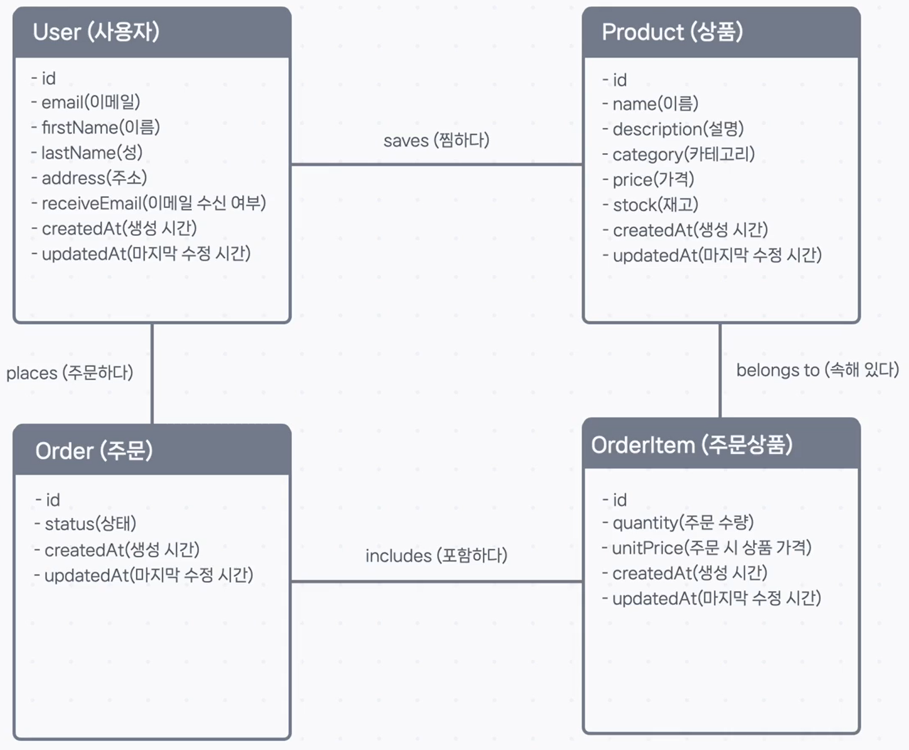

## 🕵️‍♂️ 데이터 탐정 되기: ER 모델링 실전

데이터베이스의 청사진인 ER 모델을 그리려면, 먼저 우리 서비스의 규칙 속에서 데이터의 단서를 찾아내야 합니다. 서비스가 따라야 할 규칙인 **비즈니스 규칙(Business Rules)** 을 분석하여 개체, 속성, 관계를 찾아내는 과정을 함께 해보겠습니다.

### 1단계: 📝 비즈니스 규칙(Business Rules) 정의하기

먼저, 우리가 만들 e-커머스 서비스가 따라야 할 규칙들을 명확하게 정의합니다.

#### **사용자 규칙**

- 회원가입 시 **사용자**의 **이메일**, **성**, **이름**, **주소**를 입력받는다.
- 회원가입 시 **이메일 수신 여부**를 물어본다.

#### **상품 규칙**

- 웹 사이트에서 **상품**의 **이름**, **설명**, **가격**을 보여준다.
- **상품**은 7가지 **카테고리**로 나뉜다.
- **상품**마다 **재고**를 기록한다.
- **사용자**는 **상품**을 **찜할 수 있다.**

#### **주문 규칙**

- **사용자**는 **주문**을 **할 수 있다.**
- **주문**은 여러 **상품**을 **포함**하며, 각 **상품**에 대한 **주문 수량**과 **주문 시 가격**이 있다.
- **주문** 시 **재고**가 부족하면 **주문**을 생성하지 않는다.
- **주문**이 생성되면 `PENDING` **상태**를 가지고, 배송이 완료되면 `COMPLETE` **상태**를 가진다.

#### **그 외 규칙**

- 모든 데이터에 대해 **생성 시간**과 마지막 **수정 시간**을 저장한다.

---

### 2단계: 규칙 속에서 후보군 찾기

이제 정의한 비즈니스 규칙 속에서 명사와 동사를 분석하여 개체, 속성, 관계의 후보를 찾아냅니다.

- **개체(Entity) 후보**: '하나의 값'으로 표현할 수 없는 중요한 **명사** (→ `사용자`, `상품`, `주문`)
- **속성(Attribute) 후보**: '하나의 값'으로 표현할 수 있는 세부 정보 **명사** (→ `이메일`, `이름`, `가격`, `재고`, `상태` 등)
- **관계(Relationship) 후보**: 개체와 개체 사이를 이어주는 **동사** (→ `찜하다`, `주문하다`, `포함하다`)

이 단서들을 바탕으로 첫 번째 ER 모델을 그려볼 수 있습니다.

> **💡 모든 규칙이 모델링에 쓰이나요?**
>
> 아닙니다. "재고가 부족하면 주문을 생성하지 않는다"와 같은 규칙은 데이터의 '구조'가 아닌 '로직'에 해당하므로, 나중에 API 코드 레벨에서 구현하게 됩니다.

---

### 3단계: 🤔 모델의 문제점 발견하기

첫 번째 ER 모델을 자세히 보면, 어색한 부분이 있습니다.

**`주문 수량(quantity)`과 `주문 시 가격(unitPrice)`은 대체 어디에 속해야 할까요?**

- **`Order` 개체에 넣기**: `Order` 개체의 속성은 주문 하나당 하나의 값만 가질 수 있습니다. 하지만 하나의 주문에는 여러 상품이 각기 다른 수량과 가격으로 포함될 수 있으므로 (`A상품 2개`, `B상품 1개`), `Order` 개체에 넣는 것은 적절하지 않습니다.
- **`Product` 개체에 넣기**: 이것도 말이 안 됩니다. `주문 수량`은 특정 '주문'에만 해당하는 값이지, '상품' 자체가 가진 고유한 속성이 아니기 때문입니다.

이처럼 두 속성은 **`Order`와 `Product`의 관계 위에서만 의미를 갖는 속성**입니다.

---

### 4단계: ✅ 중간 개체(OrderItem)로 문제 해결하기

**관계에 대한 속성**이 존재할 때는, 두 개체 사이에 이 관계를 전문적으로 표현해 줄 **중간 개체(Associative Entity)** 를 새로 만드는 것이 정석적인 해결 방법입니다.

우리는 **`OrderItem` (주문 상품)** 이라는 새로운 개체를 만들겠습니다.

- `OrderItem` 개체는 '어떤 주문'에 '어떤 상품'이 포함되었는지를 나타냅니다.
- 그리고 이 `OrderItem` 개체 안에, 관계에 대한 속성이었던 `주문 수량`과 `주문 시 가격`을 저장합니다.

이제 관계가 아래와 같이 명확하게 재정의됩니다.

- 하나의 `Order`는 여러 개의 `OrderItem`을 **포함한다(includes).**
- 하나의 `Product`는 여러 `OrderItem`에 **속할 수 있다(belongs to).**

---

### 5단계: 최종 ER 모델 완성하기

`OrderItem`이라는 중간 개체를 도입하여 완성된 최종 ER 모델은 다음과 같습니다.

이처럼 데이터 모델링은 처음부터 완벽한 설계를 하는 것이 아니라, 비즈니스 규칙을 분석하고, 모델을 만들고, 문제점을 발견하며 점진적으로 개선해 나가는 과정입니다. 이제 이 최종 ER 모델을 바탕으로 `schema.prisma` 파일을 작성할 준비가 되었습니다.
