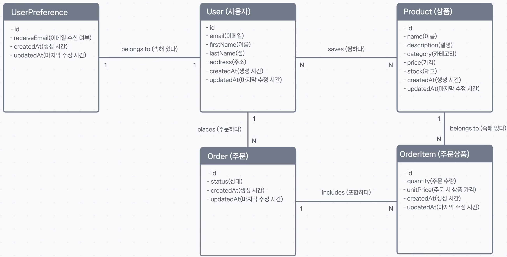

## 🔗 관계에 깊이를 더하다: 카디널리티(Cardinality) 이해하기

ER 모델을 통해 개체(Entity)들이 서로 연결되어 있다는 것은 알았지만, **'어떻게'** 연결되어 있는지는 아직 모릅니다. 예를 들어, 한 명의 유저가 주문을 '여러 개' 할 수 있는지, 아니면 '딱 하나'만 할 수 있는지와 같은 구체적인 규칙이 필요하죠.

이처럼 개체 간 관계의 수(數) 또는 정도를 정의하는 것을 **카디널리티(Cardinality)** 라고 합니다. 이는 데이터 모델링에서 아주 중요한 부분입니다.

---

### ### 1. 관계의 종류 파악하기 (1:1, 1:N, N:N)

카디널리티는 크게 세 가지 종류가 있습니다. 우리 e-커머스 모델의 관계를 예시로 하나씩 살펴보겠습니다.

#### **1 : N (일대다 관계, One-to-Many)**

가장 흔한 관계입니다. 개체 A의 한 인스턴스가 개체 B의 여러 인스턴스와 연결될 수 있지만, 개체 B의 한 인스턴스는 개체 A의 단 하나의 인스턴스와만 연결됩니다.

- **`사용자`와 `주문`**: 한 명의 **사용자(1)** 는 여러 개의 **주문(N)** 을 할 수 있지만, 하나의 **주문(1)** 은 반드시 한 명의 **사용자(1)** 에게만 속합니다. → **1:N 관계**
- **`주문`과 `주문상품`**: 하나의 **주문(1)** 은 여러 개의 **주문상품(N)** 을 포함할 수 있지만, 하나의 **주문상품(1)** 은 반드시 하나의 **주문(1)** 에만 속합니다. → **1:N 관계**

#### **N : N (다대다 관계, Many-to-Many)**

개체 A의 한 인스턴스가 개체 B의 여러 인스턴스와 연결될 수 있고, 그 반대도 마찬가지인 관계입니다.

- **`사용자`와 `상품` (찜하기)**: 한 명의 **사용자(N)** 는 여러 **상품(N)** 을 찜할 수 있고, 하나의 **상품(N)** 은 여러 **사용자(N)** 에게 찜을 당할 수 있습니다. → **N:N 관계**
  

#### **1 : 1 (일대일 관계, One-to-One)**

개체 A의 한 인스턴스가 개체 B의 단 하나의 인스턴스와만 연결되고, 그 반대도 마찬가지인 관계입니다. 보통 특정 개체의 '부가 정보'를 따로 저장할 때 사용됩니다.

- **`사용자`와 `사용자 설정`**: 만약 이메일 수신 여부 같은 설정을 별도의 `UserPreference` 개체로 분리한다면, 한 명의 **사용자(1)** 는 하나의 **사용자 설정(1)** 만 가질 수 있습니다. → **1:1 관계**
  

---

### ### 2. 다이어그램에 카디널리티 표현하기

관계의 종류를 파악했다면, 이제 ER 다이어그램의 관계선 위에 이 정보를 표시해야 합니다.

#### 까마귀발 표기법 (Crow's Foot Notation)

ER 다이어그램에서는 **까마귀발 표기법(Crow's Foot Notation)** 이라는 표준적인 방식을 가장 많이 사용합니다.

- **`|` (선)**: **하나 (One)** 를 의미합니다.
- **`O` (원)**: **0 (Zero)** 을 의미합니다.
- **까마귀발 모양**: **여럿 (Many)** 을 의미합니다.

이 기호들을 조합하여 관계를 아주 상세하게 표현할 수 있습니다.

---

### ### 3. 최소-최대 카디널리티: 관계의 필수/선택 여부

까마귀발 표기법을 사용하면, 관계의 최대치뿐만 아니라 **최소치**까지 표현하여 관계가 **필수적인지 선택적인지** 나타낼 수 있습니다.

예를 들어, `사용자`와 `주문`의 관계를 다시 생각해 봅시다.

- 사용자는 주문을 여러 개 할 수도 있지만, 회원가입만 하고 **하나도 안 할 수도 있습니다 (최소 0개).**
- 반면, 주문은 저절로 생성될 수 없습니다. 하나의 주문은 **반드시 한 명의 사용자에 의해** 만들어집니다 **(최소 1개).**

이 '최소-최대' 관계를 까마귀발 표기법으로 표현하면 다음과 같습니다.

- **`사용자` → `주문` 쪽 기호 (`O-까마귀발`)**: 사용자는 **최소 0개(O)**, **최대 여러 개(까마귀발)** 의 주문을 가질 수 있다. (주문은 선택 사항)
- **`주문` → `사용자` 쪽 기호 (`|-|`)**: 주문은 **최소 1개(|)**, **최대 1개(|)** 의 사용자를 가져야만 한다. (사용자는 필수 사항)

이처럼 카디널리티를 상세하게 정의하면, 데이터 모델이 훨씬 더 명확해지고, 나중에 Prisma 스키마를 작성할 때 필드가 필수인지 선택 사항인지 등을 쉽게 결정할 수 있습니다.
