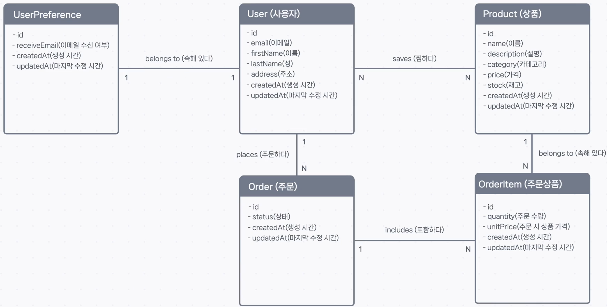
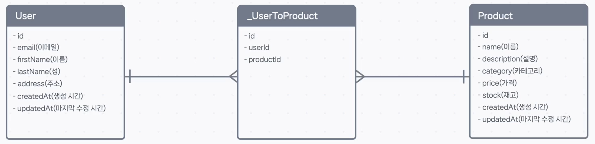

## 🏗️ 설계도에서 현실로: ER 모델을 데이터베이스 테이블로 구현하기

ER 다이어그램으로 데이터의 '관계 지도'를 그렸으니, 이제 **외래 키(Foreign Key)** 라는 '다리'를 놓아 실제 데이터베이스 테이블들을 연결할 차례입니다.

**외래 키**는 한 테이블의 열(column)이 다른 테이블의 기본 키(Primary Key)를 참조하여, 어떤 데이터끼리 연결되어 있는지 알려주는 핵심적인 역할을 합니다.

관계의 종류, 즉 카디널리티(1:1, 1:N, N:N)에 따라 이 '다리'를 놓는 방법이 조금씩 다릅니다. 하나씩 살펴보겠습니다.

---

### 1. 최대 카디널리티 구현하기

#### **1:N (일대다 관계)**

`User`와 `Order`의 관계처럼, 한쪽은 '1'이고 다른 쪽은 'N'인 관계입니다.

> **규칙: 'N'(다) 쪽 테이블에 외래 키를 추가한다.**

하나의 `User`는 여러 `Order`를 가질 수 있으므로, **'N'에 해당하는 `Order` 테이블**에 `userId`라는 외래 키 열을 추가합니다.

- **`Order` 테이블**: `userId` 열이 있으므로, 각 주문은 어떤 `User`에 속하는지 정확히 알 수 있습니다. (하나의 주문은 하나의 유저만 가리킴)
- **`User` 테이블**: 별도의 열이 없지만, 여러 `Order` 데이터들이 자신의 `id`를 `userId`로 가질 수 있으므로, 여러 주문과 연결됩니다.

#### **1:1 (일대일 관계)**

`User`와 `UserPreference`처럼 양쪽 모두 '1'인 관계입니다.

> **규칙: 어느 한쪽 테이블에 외래 키를 추가하고, 해당 열에 `UNIQUE` 제약조건을 건다.**

`UserPreference` 테이블에 `userId` 외래 키를 추가하고, 이 `userId` 값이 중복될 수 없도록 `UNIQUE` 규칙을 설정합니다. 이렇게 하면, 하나의 `UserPreference`는 오직 하나의 `User`만 가리킬 수 있고, `User` 또한 하나의 `UserPreference`와만 연결될 수 있습니다.

> **💡 외래 키는 어느 테이블에 추가할까요?**
>
> 1:1 관계에서는 어느 쪽에 외래 키를 두어도 괜찮지만, 보통 **'소유'되거나 '종속'되는 관계**를 파악하여 결정합니다. "사용자 설정은 사용자의 것이다"는 자연스럽지만, "사용자가 사용자 설정의 것이다"는 어색하죠. 따라서 종속되는 쪽인 `UserPreference`에 외래 키를 두는 것이 더 직관적입니다.

#### **N:N (다대다 관계)**

`User`와 `Product`의 '찜하기'처럼 양쪽 모두 'N'인 복잡한 관계입니다.

> **규칙: 두 테이블 사이에 새로운 '중간 테이블'을 만든다.**

다대다 관계는 외래 키 하나만으로는 표현할 수 없습니다. 따라서 **정션 테이블(Junction Table)** 또는 **조인 테이블(Join Table)** 이라고 불리는 새로운 중간 테이블을 만들어야 합니다.

`_UserToProduct`라는 정션 테이블은 `userId`와 `productId`라는 두 개의 외래 키를 가집니다. 이 테이블에 어떤 유저가 어떤 상품을 찜했는지에 대한 모든 조합을 기록합니다.

- **`_UserToProduct` 테이블**: 이 테이블 덕분에 한 명의 유저(`userId`)는 여러 상품(`productId`)과 연결될 수 있고, 하나의 상품(`productId`) 또한 여러 유저(`userId`)와 연결될 수 있습니다.

> Prisma 같은 ORM은 이런 정션 테이블을 자동으로 생성하고 관리해주는 경우가 많지만, 데이터베이스 레벨에서 다대다 관계가 어떻게 구현되는지 이해하고 있는 것이 매우 중요합니다.

---

### 2. 최소 카디널리티 구현하기 (심화)

최대 카디널리티가 '몇 개까지' 연결될 수 있는지를 나타냈다면, 최소 카디널리티는 **'반드시'** 연결되어야 하는지(**필수**), 아니면 **'연결되지 않을 수도 있는지'(선택)** 를 결정합니다.

이것은 외래 키 열의 **`NULL` 허용 여부**로 제어할 수 있습니다.

| 외래 키 열 설정       | 관계                    | 의미                                     | 최소 카디널리티          |
| :-------------------- | :---------------------- | :--------------------------------------- | :----------------------- |
| **`NOT NULL`** (필수) | Mandatory (필수적 관계) | `Order`는 `userId`가 반드시 있어야 한다. | 상대 개체는 **최소 1개** |
| **`NULL`** (선택)     | Optional (선택적 관계)  | `Order`는 `userId`가 없을 수도 있다.     | 상대 개체는 **최소 0개** |

예를 들어, `Order` 테이블의 `userId`를 `NOT NULL`(필수)로 설정하면, 모든 주문은 반드시 한 명의 유저와 연결되어야 함을 의미합니다(유저 쪽 최소 카디널리티 1).

반면, 한 명의 유저가 주문을 하나도 하지 않을 수 있으므로(`Order` 테이블에 해당 `userId`가 하나도 없음), 주문 쪽의 최소 카디널리티는 기본적으로 0이 됩니다. 이처럼 특정 유저가 반드시 주문을 하나 이상 갖도록 강제하는 것은 데이터베이스 레벨보다는 애플리케이션 코드 로직으로 처리하는 경우가 많습니다.

---

### ✅ 최종 모델

지금까지의 내용을 모두 ER 모델에 반영하면, 어떤 테이블에 어떤 외래 키가 필요한지 명확하게 볼 수 있습니다. (파란색 필드가 외래 키)

이제 외래 키의 원리를 이해했으니, 어떤 관계를 만나더라도 테이블 구조를 자신 있게 설계할 수 있을 것입니다.
