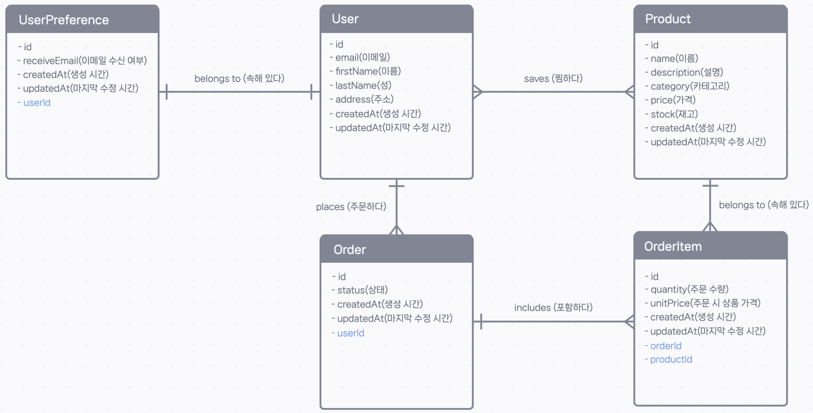
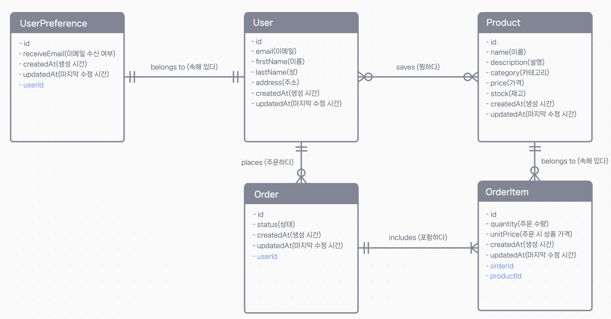

## 🔗 관계 정의하기 (1): 일대다 관계 (One-to-Many)

ER 모델링을 통해 데이터 간의 관계를 설계했으니, 이제 이 관계를 Prisma 스키마 코드로 직접 구현해 보겠습니다. 관계를 구현하는 방법을 이해하면 Prisma의 진짜 강력함을 경험할 수 있습니다.

ER 모델(최대 카디널리티)


ER 모델(최대-최소 카디널리티)


가장 먼저, 가장 흔한 관계인 **일대다(1:N) 관계**부터 시작해 보겠습니다.

### 1단계: 기본 모델 준비 및 마이그레이션

관계를 정의하기 전에, ER 모델에 있었던 `UserPreference`, `Order`, `OrderItem` 모델과 필요한 `enum`들을 `schema.prisma` 파일에 먼저 추가해야 합니다.

```prisma
// /prisma/schema.prisma

// ... (User, Product 모델 및 Category enum 생략) ...

model UserPreference {
  id           String   @id @default(uuid())
  receiveEmail Boolean
  createdAt    DateTime @default(now())
  updatedAt    DateTime @updatedAt
}

model Order {
  id        String      @id @default(uuid())
  status    OrderStatus @default(PENDING)
  createdAt DateTime    @default(now())
  updatedAt DateTime    @updatedAt
}

model OrderItem {
  id        String   @id @default(uuid())
  unitPrice Float
  quantity  Int
  createdAt DateTime @default(now())
  updatedAt DateTime @updatedAt
}

enum OrderStatus {
  PENDING
  COMPLETE
}
```

새로운 모델들을 추가했으니, 마이그레이션을 통해 데이터베이스에 먼저 반영해 줍니다.

```bash
npx prisma migrate dev --name add_user_preference_order_order_item_models
```

---

### 2단계: `User`와 `Order` 관계 정의하기

ER 모델에 따르면, `User`와 `Order`는 **1:N (일대다)** 관계입니다.

- 한 명의 `User`는 여러 `Order`를 가질 수 있다. (1)
- 하나의 `Order`는 반드시 한 명의 `User`에게 속한다. (N)

이 관계를 Prisma 스키마에 정의하는 방법은 다음과 같습니다.

> **규칙: 1:N 관계에서는 항상 'N'(다) 쪽 모델에 외래 키(Foreign Key)를 추가합니다.**

```prisma
// /prisma/schema.prisma

model User {
  id        String   @id @default(uuid())
  email     String   @unique
  firstName String
  lastName  String
  address   String
  createdAt DateTime @default(now())
  updatedAt DateTime @updatedAt

  // 2. User 모델에는 Order[] 타입의 관계 필드를 추가합니다.
  //    'orders' 필드를 통해 해당 유저의 모든 주문에 접근할 수 있습니다.
  orders    Order[]
}

model Order {
  id        String      @id @default(uuid())
  status    OrderStatus @default(PENDING)
  createdAt DateTime    @default(now())
  updatedAt DateTime    @updatedAt

  // 1. Order 모델에는 User 타입의 관계 필드와
  //    실제 외래 키 역할을 할 userId 필드를 추가합니다.
  //    `user User`을 입력하고 포맷팅(ctrl+s)을 자동 생성된다.
  user      User     @relation(fields: [userId], references: [id])
  userId    String
}
```

---

### 🕵️‍♂️ 관계 필드, 자세히 알아보기

위 코드에서 `user`, `orders`, `userId` 필드가 추가되었습니다. 이들은 두 종류로 나뉩니다.

- **관계 필드 (Relation Fields)**: `user`와 `orders`
  - 데이터베이스 테이블에는 실제 생성되지 않는, **Prisma Client를 위한 가상 필드**입니다.
  - 코드에서 관계를 쉽게 탐색할 수 있도록 도와줍니다. 예를 들어, `order.user`로 주문자의 정보에 접근하거나 `user.orders`로 해당 유저의 모든 주문 목록에 접근할 수 있습니다.
- **외래 키 필드 (Foreign Key Field)**: `userId`
  - `User` 테이블의 `id`를 참조하는 **실제 데이터베이스 열(column)** 입니다.
  - `@relation` 속성은 이 필드가 외래 키임을 Prisma에 명확히 알려주는 역할을 합니다.
    - `fields: [userId]`: 이 모델(`Order`)의 `userId` 필드가
    - `references: [id]`: `User` 모델의 `id` 필드를 참조한다는 의미입니다.

> **💡 Prisma의 편리한 자동 완성**
>
> 관계를 정의할 때 `Order` 모델에 `user User` 한 줄만 먼저 작성하고 파일을 저장(포맷팅)해 보세요. Prisma 확장 프로그램이 나머지 `userId` 필드와 `@relation` 속성, 그리고 `User` 모델의 `orders` 필드까지 자동으로 완성해주는 마법을 경험할 수 있습니다\!

---

### ✅ 마이그레이션 및 결과 확인

관계 정의가 끝났으니, 다시 마이그레이션을 실행하여 데이터베이스에 변경사항을 적용합니다.

```bash
npx prisma migrate dev --name add_user_order_relation
```

마이그레이션이 성공하면 `npx prisma studio`를 실행하여 결과를 확인해 보세요.

- `Order` 모델에 `user`와 `userId` 열이 새로 생긴 것을 볼 수 있습니다.
- `User` 모델에는 `orders` 열이 추가되었습니다.
- Studio에서 새로운 `Order`를 추가할 때, `user` 필드에서 기존에 생성된 `User`를 선택하면 `userId`가 자동으로 채워지는 것을 확인할 수 있습니다.

이제 여러분의 스키마는 `User`와 `Order` 사이의 일대다 관계를 완벽하게 표현하게 되었습니다\! 🎉
