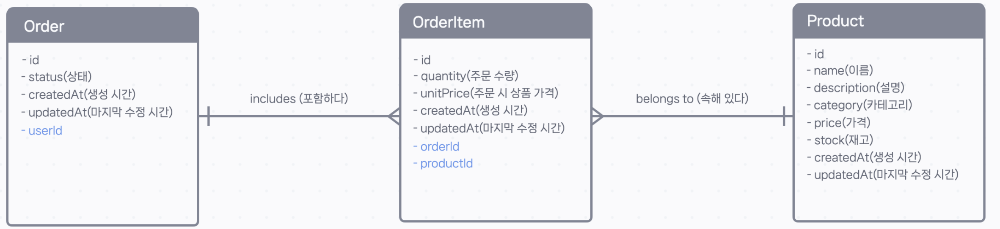

## 🛒 (실습) 일대다 관계 정의하기 - Order-OrderItem-Product 관계 정의

`User`와 `Order` 사이의 관계를 성공적으로 정의해 보았습니다. 이제 e-커머스 시스템의 핵심 로직인 '주문-주문상품-상품'으로 이어지는 관계를 완성해 보겠습니다.

### 실습 목표

아래 ER 다이어그램을 참고하여, `Order`, `OrderItem`, `Product` 모델 간의 관계를 `schema.prisma` 파일에 정의하고, 데이터베이스에 마이그레이션을 적용합니다.



- **`Order` ↔️ `OrderItem`**: 일대다 (1:N) 관계
- **`Product` ↔️ `OrderItem`**: 일대다 (1:N) 관계

---

### 🏗️ 마이그레이션 실행하기

`schema.prisma` 파일의 변경사항을 실제 데이터베이스에 적용할 차례입니다. 터미널에 아래 명령어를 입력하여 마이그레이션을 실행하세요.

```bash
npx prisma migrate dev --name add_order_order_item_and_order_item_product_relations
```

> **Your database is now in sync with your schema.**

성공 메시지가 나타나면 관계 정의가 모두 완료된 것입니다.

---

### 결과 확인하기

`npx prisma studio`를 실행하여 Prisma Studio에서 결과를 확인해 보세요. `OrderItem` 모델을 보면, `order`와 `product` 필드에서 각각 해당하는 `Order`와 `Product` 데이터를 선택하여 연결할 수 있는 드롭다운 메뉴가 생긴 것을 볼 수 있습니다.

이제 주문과 관련된 모든 모델들이 서로 긴밀하게 연결되었습니다\! 🎉
