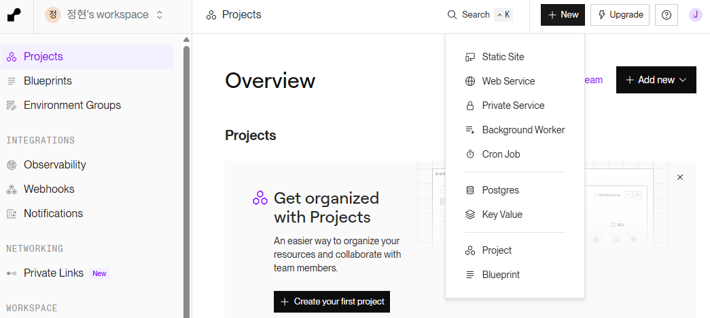

## 🚀 최종 단계: Prisma 백엔드 서버 배포하기

지금까지 열심히 개발한 e-커머스 백엔드 서버를 실제 사용자들이 이용할 수 있도록 **Render** 클라우드 서비스에 배포해 보겠습니다. 배포는 크게 **사전 준비**와 **실제 배포** 두 단계로 나뉩니다.

### 1단계: 📋 배포 사전 준비

본격적인 배포에 앞서, 우리 서버가 외부 환경에서 안전하고 올바르게 동작하기 위한 몇 가지 필수 사전 준비가 필요합니다. 이 과정은 이전에 진행했던 JavaScript 백엔드 서버 배포와 동일한 개념을 공유합니다.

아래의 각 주제에 대한 상세한 개념이 궁금하다면, 이전에 정리했던 문서를 다시 참고해 주세요.

- **1. [배포 준비](<../../1. JavaScript 백엔드 개발 시작하기/12. 배포하기/12-0. 배포 준비.md>)**
- **2. [환경 변수](<../../1. JavaScript 백엔드 개발 시작하기/12. 배포하기/12-1. 환경 변수.md>)**
- **3. [CORS 설정하기](<../../1. JavaScript 백엔드 개발 시작하기/12. 배포하기/12-2. CORS 설정하기.md>)**
- **4. [배포하기](<../../1. JavaScript 백엔드 개발 시작하기/12. 배포하기/12-3. 배포하기.md>)**
  - 3단계: 프로덕션(Production)용 DB 준비하기 전까지 진행
  - 3단계부터는 MongoDB Atlas에 대한 설명

이번 Prisma 프로젝트 배포 과정에서도 위 개념들을 바탕으로 설정을 진행합니다.

---

### 2단계: ☁️ Production용 PostgreSQL 데이터베이스 생성하기

로컬 컴퓨터에 설치한 PostgreSQL은 개발 중에만 사용할 수 있습니다. 실제 서비스에서는 인터넷을 통해 24시간 접속 가능한 클라우드 데이터베이스가 필요합니다. Render는 웹 서비스뿐만 아니라 데이터베이스 생성 기능도 무료로 제공합니다.

1.  Render 대시보드에서 **`New +`** 버튼을 누르고 **`PostgreSQL`** 을 선택합니다.
    

2.  아래와 같이 정보를 입력하고 **`Create Database`** 버튼을 클릭합니다.

    - **Name**: 데이터베이스의 고유한 이름 (예: `hyunmazon-db`)
    - **Database**: 실제 접속 시 사용할 데이터베이스 이름 (예: `hyunmazon`)
    - **PostgreSQL Version**: 최신 안정 버전을 선택합니다.

3.  데이터베이스 생성이 완료될 때까지 잠시 기다립니다.

4.  생성된 데이터베이스 info 페이지에서, **`Internal Database URL`** 을 찾아 복사해 둡니다. 이 주소는 잠시 후 우리 웹 서비스(백엔드 서버)가 데이터베이스에 접속할 때 사용됩니다.

> **⚠️ 무료 플랜 안내**
>
> Render의 무료 데이터베이스는 생성 후 30일(약 1개월)이 지나면 만료되어 삭제될 수 있습니다. 학습용으로는 충분하지만, 실제 서비스를 운영하려면 유료 플랜으로 업그레이드가 필요합니다.

---

### 3단계: ⚙️ Render 웹 서비스 생성 및 설정하기

이제 우리 코드를 실행할 웹 서비스를 생성하고, 방금 만든 데이터베이스와 연결할 차례입니다.

1.  Render 대시보드에서 **`New +`** 버튼을 누르고 **`Web Service`** 를 선택합니다.
    

2.  이전에 연동했던 GitHub 저장소를 선택하고, 아래와 같이 서비스 설정을 진행합니다.

    - **Name**: 웹 서비스의 고유한 이름 (예: `hyunmazon-api`)
    - **Root Directory**: 저장소의 루트가 아닌 하위 폴더에서 프로젝트를 실행할 경우, 해당 폴더의 경로를 지정합니다. (예: `./node02-js-rdb-server/e-commerce`)
    - **Build Command**: `npm install --production && npx prisma migrate deploy && npx prisma generate`

      - `npm install --production`: package.json 파일의 dependencies 목록에 있는 패키지들 설치
      - `npx prisma migrate deploy`: 마이그레이션을 적용,`migrate dev`는 최종 마이그레이션 이후 스키마 변경사항이 있었는지 확인하고 Prisma Client도 최신 모델 정보 기반으로 생성. 하지만 `migrate deploy`는 아직 적용되지 않은 마이그레이션을 적용하기만 한다. production 환경에서는 필요한 작업들만 수행하고 성능에 초점을 두기 때문에 `migrate deploy`를 사용하는 것
      - `npx prisma generate`: 최신 모델 정보 기반으로 Prisma Client를 생성

    - **Start Command**: `npm start`
    - **Instance Type**: `Free` (무료)

> **💡 `npx prisma migrate dev`와 `npx prisma generate`의 차이** > `npx prisma migrate dev`: 데터베이스 스키마 변경 및 클라이언트 코드 생성
> `npx prisma generate`: 클라이언트 코드 생성(schema.prisma 파일만 전달 받은 경우)

3.  스크롤을 내려 **`Advanced`** 섹션을 펼치고, **환경 변수(Environment Variables)** 를 설정합니다.

    - **`Add Environment Variable`** 버튼을 클릭합니다.
    - **Key**에는 `DATABASE_URL`, **Value**에는 **2단계에서 복사해 둔 `Internal Database URL`** 을 붙여넣습니다.
    - 필요하다면 `NODE_VERSION` Key를 추가하여 로컬에서 사용하던 Node.js 버전을 지정해 줄 수 있습니다.

4.  모든 설정이 끝났으면 맨 아래의 **`Create Web Service`** 버튼을 클릭합니다.

> **💡 `migrate dev` vs `migrate deploy`**
>
> - `npx prisma migrate dev`: 개발 환경에서 사용하며, 스키마 변경사항을 감지하여 새로운 마이그레이션 파일을 만들고, 데이터베이스와 스키마를 동기화하며, Prisma Client까지 재생성하는 **'만능'** 명령어입니다.
> - `npx prisma migrate deploy`: 프로덕션(배포) 환경에서 사용하며, **오직 아직 적용되지 않은 마이그레이션 파일들을 실행**하는 역할만 합니다. 더 빠르고 안정적이어서 배포 과정에 더 적합합니다.

---

### 4단계: 🌱 데이터 시딩하기 (선택 사항)

배포된 데이터베이스는 현재 비어있습니다. 만약 초기 데이터가 필요하다면, 로컬 컴퓨터에서 원격 데이터베이스로 직접 시딩을 진행할 수 있습니다.

1.  **`.env` 파일 임시 수정**: 로컬 프로젝트의 `.env` 파일에 있는 `DATABASE_URL` 값을, Render 데이터베이스 info 페이지의 **`External Database URL`** 로 **잠시** 변경합니다.
2.  **시드 명령어 실행**: 로컬 프로젝트 터미널에서 아래 명령어를 실행합니다.
    ```bash
    npx prisma db seed
    ```
3.  **`.env` 파일 원상 복구**: 시딩이 끝나면, `.env` 파일의 `DATABASE_URL`을 **원래의 로컬 DB 주소로 반드시 되돌려 놓습니다.**

---

### ✅ 배포 완료\!

Render의 로그 화면에 서버와 DB가 성공적으로 연결되었다는 메시지가 뜨고, 서비스 상태가 **`Live`** 로 바뀌면 배포에 성공한 것입니다.

이제 페이지 위쪽에 `https://내-서비스-이름.onrender.com` 형태의 공개 주소를 사용하여, 어디서든 여러분이 만든 API를 호출할 수 있습니다\! 🎉
