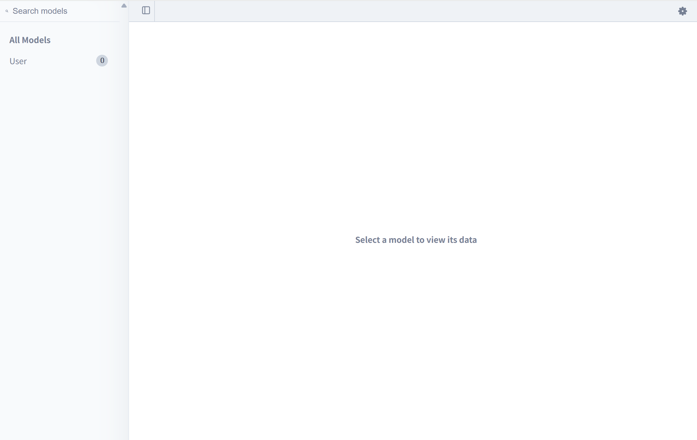
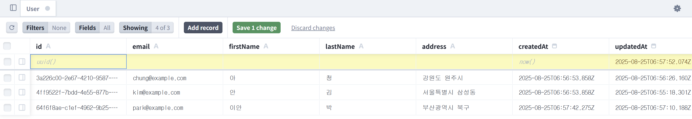

## 🏗️ 설계도를 현실로: Prisma 마이그레이션 & Prisma Studio

`schema.prisma` 파일에 데이터베이스의 멋진 설계도를 그렸으니, 이제 이 설계도를 바탕으로 실제 데이터베이스에 테이블을 **건축**할 시간입니다.

Prisma에서는 이 과정을 **마이그레이션(Migration)** 이라고 부릅니다. `schema.prisma` 파일에 변경사항이 생길 때마다 마이그레이션을 실행해서, 설계도와 실제 데이터베이스의 모습을 항상 똑같이 유지(sync)해줘야 합니다.

---

### 1. 첫 번째 마이그레이션 실행하기

터미널에 아래 명령어를 입력하여 마이그레이션을 시작합니다.

```bash
npx prisma migrate dev
```

이 명령어를 실행하면 Prisma가 몇 가지 질문을 합니다.

> **? Enter a name for the new migration: »**

마이그레이션 기록에 남길 이름을 입력하라는 의미입니다. 보통 첫 번째 마이그레이션은 `init` (initialize)이라고 많이 부릅니다. `init`을 입력하고 엔터를 누르세요.

잠시 후, Prisma가 모든 작업을 마치고 성공 메시지를 보여줍니다.

> **Your database is now in sync with your schema.**

이제 우리의 `schema.prisma` 설계도와 PostgreSQL 데이터베이스가 완벽하게 동기화되었습니다\!

---

#### 마이그레이션, 그 뒤에서는 무슨 일이?

`npx prisma migrate dev` 명령어는 우리를 위해 다음 작업들을 자동으로 처리해 줍니다.

1.  **데이터베이스 생성**: `.env` 파일에 지정한 `hyunmazon_dev` 데이터베이스가 없다면 새로 생성합니다.
2.  **SQL 변환**: `schema.prisma` 파일의 모델 정의를 읽고, 실제 테이블을 생성하는 **SQL 코드**로 변환합니다.
3.  **SQL 실행**: 변환된 SQL 코드를 데이터베이스에 직접 실행하여 `User` 테이블을 생성합니다.
4.  **기록**: 마이그레이션 내역을 `prisma/migrations` 폴더에 기록하여, 어떤 변경사항이 있었는지 추적할 수 있게 합니다.

`prisma/migrations/xxxxxxxx_init/` 폴더 안에 생성된 `migration.sql` 파일을 열어보면, Prisma가 우리를 대신해 실행해 준 SQL 코드를 직접 확인할 수 있습니다.

```sql
-- CreateTable
CREATE TABLE "User" (
    "id" TEXT NOT NULL,
    "email" TEXT NOT NULL,
    "firstName" TEXT NOT NULL,
    "lastName" TEXT NOT NULL,
    "address" TEXT NOT NULL,
    "createdAt" TIMESTAMP(3) NOT NULL DEFAULT CURRENT_TIMESTAMP,
    "updatedAt" TIMESTAMP(3) NOT NULL,

    CONSTRAINT "User_pkey" PRIMARY KEY ("id")
);

-- CreateIndex
CREATE UNIQUE INDEX "User_email_key" ON "User"("email");
```

Prisma 모델이 실제 테이블과 컬럼으로 잘 변환된 것을 볼 수 있죠?

---

### 2. 👩‍💻 데이터베이스 둘러보기: Prisma Studio

테이블이 잘 만들어졌는지, 데이터는 잘 들어있는지 직접 보고 싶을 때가 있습니다. Prisma는 **Prisma Studio**라는 아주 편리한 GUI(그래픽 인터페이스) 도구를 제공합니다.

터미널에 아래 명령어를 입력하여 Prisma Studio를 실행하세요.

```bash
npx prisma studio
```

명령어를 실행하면 자동으로 웹 브라우저에 Prisma Studio 화면이 열립니다.


- **데이터 조회**: 왼쪽 메뉴에서 `User` 모델을 클릭하면 `User` 테이블의 데이터를 볼 수 있습니다. (지금은 비어있습니다.)
- **데이터 추가**: `Add record` 버튼을 눌러 새로운 데이터를 직접 추가할 수 있습니다. `id`, `createdAt`처럼 `@default`나 `@updatedAt` 속성이 있는 필드는 비워두면 자동으로 채워집니다.
- **데이터 수정 및 삭제**: 필드를 클릭해서 값을 바꾸거나, 레코드를 선택하여 삭제할 수도 있습니다.
- **기타 기능**: 필터링, 특정 필드만 보기, 데이터 개수 제한 등 개발에 유용한 다양한 기능을 제공합니다.
  
  마치 데이터베이스를 위한 엑셀 프로그램 같습니다.

개발 중에 테스트용 데이터를 넣거나, 데이터가 잘 들어갔는지 확인할 때 Prisma Studio를 적극적으로 활용하면 개발 효율이 크게 올라갑니다.
