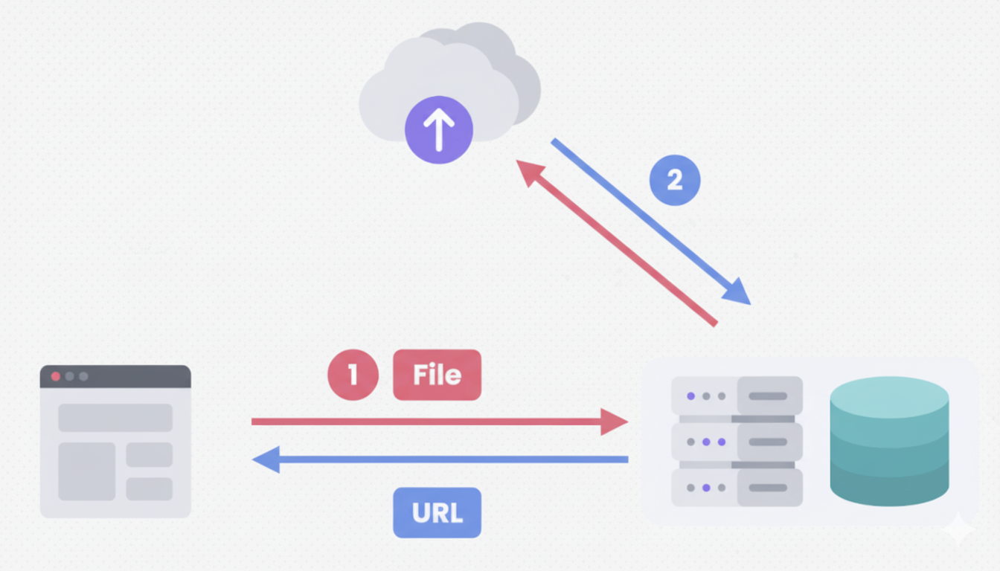

## 🤔 업로드된 파일, 어디에 저장해야 할까?

지금까지 우리는 `multer`를 사용해 클라이언트가 보낸 파일을 서버의 디스크(예: `uploads` 폴더)에 저장했습니다. 단순히 파일을 올리고 내려받는 기능만 필요하다면 이 방법으로도 충분합니다.

하지만 대부분의 서비스에서는 파일과 관련된 추가 정보가 필요합니다. 예를 들어, 이 사진이 어떤 게시물의 첨부파일인지, 어떤 사용자의 프로필 사진인지 등을 알아야 하죠. 이 문제를 해결하기 위한 여러 파일 저장 전략을 알아보겠습니다.

---

### 전략 1: 데이터베이스에 직접 저장하기

가장 먼저 떠오르는 생각은 파일 자체를 데이터베이스에 저장하는 것입니다. 예를 들어, `Posts` 테이블의 `attachment` 컬럼에 파일의 바이너리 데이터를 직접 저장하는 방식이죠.

- **👎 단점:** 이 방법은 거의 사용되지 않습니다.
  - **비용과 성능**: 파일 데이터는 텍스트보다 훨씬 용량이 큽니다. 비싼 데이터베이스 저장 공간을 빠르게 소모시키고, 데이터를 읽고 쓰는 과정에서 서버에 큰 부담을 줍니다.
  - **용량 한계**: 데이터베이스는 용량 확장이 어렵고 비용이 많이 듭니다.


> **💡 일반적인 패턴:**
> 데이터베이스에는 파일 자체를 저장하는 대신, **파일에 대한 정보(메타데이터)만 저장**합니다. 예를 들어, 사용자가 올린 파일의 원본 이름, 서버에 저장된 이름, 파일 경로, 크기 등을 텍스트로 저장하는 것이죠.

---

### 전략 2: 서버 디스크에 저장하기 (지금까지의 방식)

그렇다면 파일은 서버의 하드 디스크에 저장하고, 데이터베이스에는 그 파일의 위치 정보만 저장하면 어떨까요? 이것이 우리가 지금까지 사용한 방식입니다.

- **👍 장점**: 구현이 간단하고 직관적입니다.
- **👎 단점:** 이 방법 역시 한계가 명확합니다.
  - **용량 한계**: 서버의 디스크 공간은 무한하지 않습니다. 사용자가 계속 파일을 올리면 언젠가는 꽉 차게 됩니다.
  - **확장성 문제**: 나중에 트래픽이 늘어 서버를 여러 대로 늘릴 경우, 각 서버에 파일이 흩어져 있어 관리하기 매우 어려워집니다.

---

### 전략 3: 클라우드 스토리지 사용하기 (권장 방식)

위의 문제들을 해결하기 위해, 대부분의 현대적인 서비스는 **클라우드 스토리지**를 사용합니다. **[AWS S3](https://aws.amazon.com/ko/s3/)**, **[Google Cloud Storage](https://cloud.google.com/storage?hl=ko)** 등이 대표적입니다.

> **비유로 이해하기: 개인 창고 서비스 📦**
>
> 클라우드 스토리지는 파일만을 전문적으로 보관해주는 거대한 '개인 창고'와 같습니다. 내 서버 공간은 비즈니스 로직 처리에만 집중하고, 용량을 많이 차지하는 파일들은 용량이 거의 무한대인 전문 창고에 맡기는 것이죠.

`multer`는 이런 클라우드 스토리지와 쉽게 연동할 수 있도록 `dest` 옵션 대신 `storage` 옵션을 제공합니다.

```javascript
// dest 대신 storage 옵션을 사용하여 더 복잡한 저장 로직을 정의할 수 있습니다.
const upload = multer({ storage: myCloudStorageEngine });
```



`multer`만으로는 불가능하며, **[multer-s3](https://github.com/anacronw/multer-s3)** 라이브러리와 같이 각 클라우드 서비스에 맞는 라이브러리를 함께 사용해야 합니다. 이 라이브러리들은 파일을 서버를 거쳐 클라우드 스토리지로 보내주는 역할을 합니다.

---

### 심화: 클라이언트에서 스토리지로 직접 업로드하기

그런데 '클라이언트 → 서버 → 스토리지' 순서로 파일을 보내는 것은 중간에 서버를 거치므로 비효율적일 수 있습니다. 서버의 부담을 늘리고 응답 속도를 저하시키죠.

이 문제를 해결하기 위해 **클라이언트가 스토리지로 직접 파일을 업로드**하는 더 효율적인 방법도 있습니다.


1.  **클라이언트**가 서버에게 "파일을 올리고 싶어요\!"라고 요청합니다.
2.  **서버**는 클라우드 스토리지 서비스에 요청하여, 아주 짧은 시간 동안 특정 파일 하나만 올릴 수 있는 **'임시 업로드 허가증(Pre-signed URL)'** 을 발급받습니다.
3.  **서버**는 이 허가증을 클라이언트에게 전달합니다.
4.  **클라이언트**는 받은 허가증을 사용해 파일을 스토리지로 직접 업로드합니다.

이 방식은 서버의 부담을 획기적으로 줄여주므로, 대용량 파일 업로드나 사용자가 많은 서비스에서 널리 사용됩니다.
